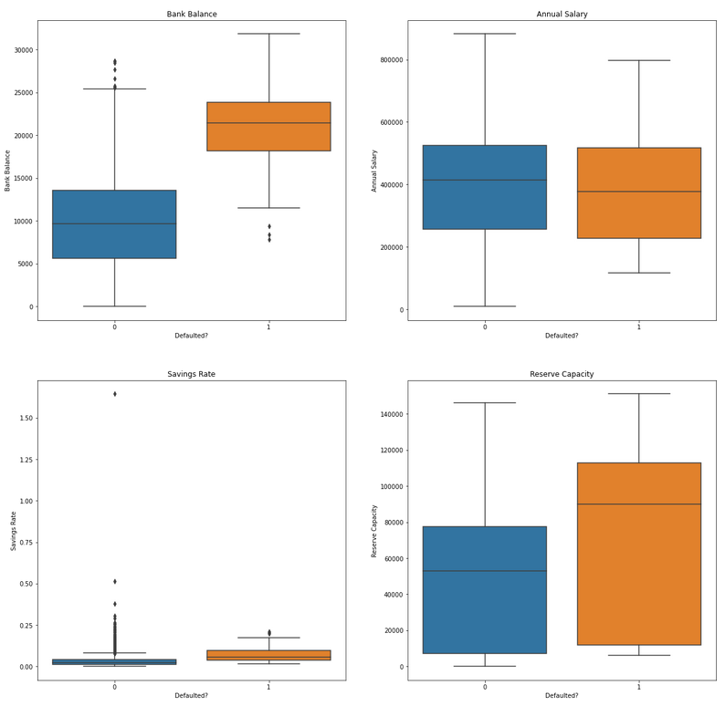

# Loan-default
Prediction of loan default based on [data](https://www.kaggle.com/kmldas/loan-default-prediction) on 10,000 customers who took out loans, financial information, and whether they defaulted on the loans. Data retrieved from Kaggle

## Project Goals
- Exploratory Data Analysis and Data Cleaning
- Feature Engineering
- Learn about and implement several classification models
- Compare results of models and build a model that predeicts loan defaults more accurately than the base case model

### EDA
I began by reading in the .csv file and using `pandas.DataFrame.describe()` and `pandas.DataFrame.info()` to draw some initial conclusions about the data:
- ~70% of loan customers are employed
- ~3% of customers defaulted on loans (low)
- very high annual salary (average of $402k)  
 

I did some basic feature engineering and created two new features:
- Savings rate: the proportion of bank balance to annual salary
- Reserve capacity: intended to reflect the ability to finance a loan with both income and existing bank balance  
 

Next, I used `matplotlib` and `seaborn` to generate several visualizations of the data. Some of the most informative are shown below:  
 
Feature Distribution Histograms  
  
 

Box Plots comparing customers who defaulted to customers who did not for each feature  
  
 

Pairplots and Scatter Matrix Comparing Each Figure  
  

