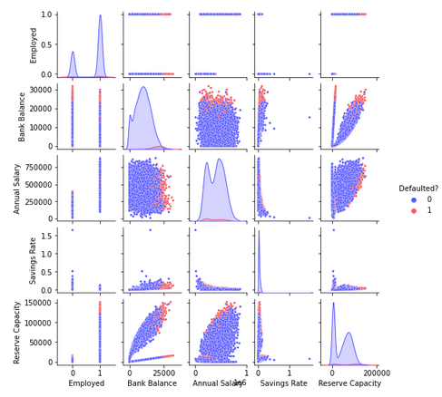

# Loan-default
Prediction of loan default based on [data](https://www.kaggle.com/kmldas/loan-default-prediction) on 10,000 customers who took out loans, financial information, and whether they defaulted on the loans. Data retrieved from Kaggle

## Project Goals
- Exploratory Data Analysis and Data Cleaning
- Feature Engineering
- Learn about and implement several classification models
- Compare results of models and build a model that predeicts loan defaults more accurately than the base case model

### EDA and Feature Engineering
I began by reading in the .csv file and using `pandas.DataFrame.describe()` and `pandas.DataFrame.info()` to draw some initial conclusions about the data:
- ~70% of loan customers are employed
- ~3% of customers defaulted on loans (low)
- very high annual salary (average of $402k)  
<br/>

I did some basic feature engineering and created two new features:
- Savings rate: the proportion of bank balance to annual salary
- Reserve capacity: intended to reflect the ability to finance a loan with both income and existing bank balance  
<br/>

Next, I used `matplotlib` and `seaborn` to generate several visualizations of the data. Some of the most informative are shown below:  
<br/>
Feature Distribution Histograms  
  
<br/>

Box Plots comparing customers who defaulted to customers who did not for each feature  
  
<br/>

Pairplots and Scatter Matrix Comparing Each Figure  
  

<br/><br/>

### Classification Models
After I was satified with my exploratory data analysis, I used `scikit-learn` to scale the data, split it into train and test sets, and implement several classification models to fit and predict the data. Here is the list of the models I used:
- K Nearest Neighbors
- Logistic Regression
- Ridge Classifier
- Stochastic Gradient Descent
- Support Vector Classifier
- Linear Support Vector Classifier
- Guassian Process Classifier
- Decision Tree

Only about 3% of the customers defaulted on their loans, so a base model that predicts no defaults would yield about 97% accuracy. I used that base case to analyze the results of my other classification models:  
  
Although six of the eight models outperformed the base case, they all did so by less than 1%. I re-evaluated my EDA to classify a portion of the clients as low risk of default, then only evaluated the models on the high risk clients.

### Look Back at EDA
When I looked back at the box plots, I noticed that no overlap exists between the IQR of bank balance for customers who defaulted and the IQR of bank balance for customers who did not default:  
  
I decided to filter the dataset and only analyze customers whose bank balance was higher than the mean value of the non-defaulting customers' bank balances. I filtered the data and generated a new `pandas.DataFrame` and then performed EDA similar to my initial EDA. My observations from EDA about the filtered data:
- The filtered dataset is approximately half the size of the original
- 63% of the customers are employed (slightly lower than original)
- 6% defaulted (roughly twice the portion of the original)
Based on these observations, I decided to do some more feature engineering. I added a 'high risk' feature for high bank account balances above $15,000 (above the 75th percentile of non-defaulting customers but below the 25th percentile of defaulting customers). I generated the following correlation matrix for my filtered data:  
  

### Classification Models on Filtered Data
Now that I was familiar with implementing each of my classification models in `scikit-learn`, I was able to iterate through them in one block using the following for loop:  
```python
model_list = [knn, lgr, rcf, sgd, svc, lsvc, gpc, dtc]
new_scores = []

for model in model_list:
    model.fit(Xf_train, yf_train)
    model.predict(Xf_test)
    new_scores.append(model.score(Xf_test, yf_test))
```
I compared the scores to the base case the same way I had previously:


### Conclusions
- All but one of the models performed better than the base case model on the new filtered data
- The difference in percentage of correct predictions was also higher for the filtered data
- This dataset was difficult because of the extremely low portion of target values in the training data, but I learned a lot about different classification models, implementing them in scikit-learn, feature engineering, and visualizing EDA and results

### Next Steps
- I want to continue learning about the algorithms that power these models and develop a better understanding of situations and datasets that might be better suited to certain models over others
- I want to build a pipleline that can fit, predict, and cross-validate several models in order to have more efficient, human-readable, and reproducible code
